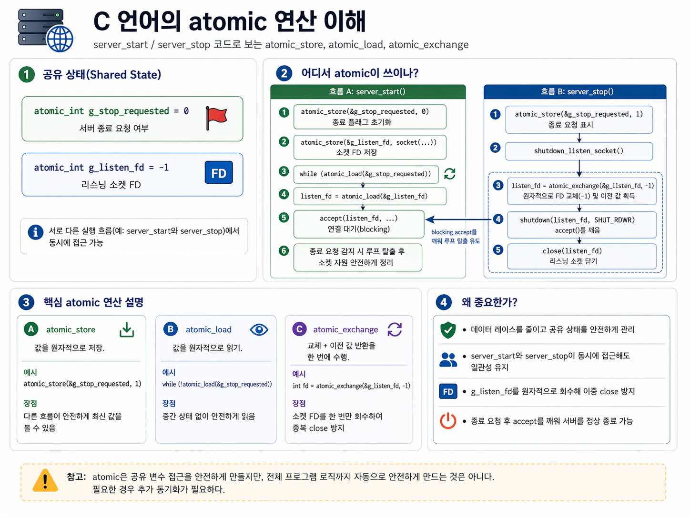
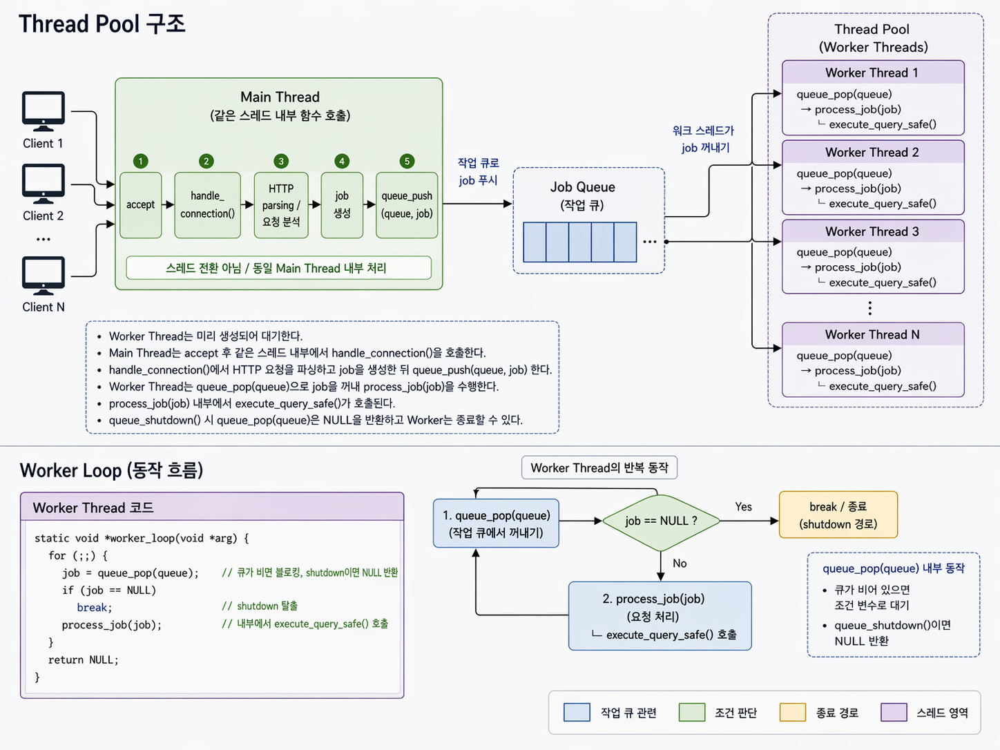
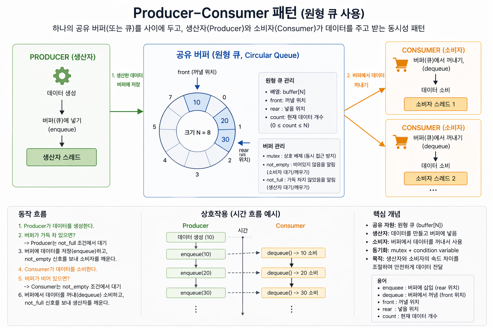

# 프로젝트 개요

SQL parser와 storage engine으로 구성된 기존 DB 엔진을 HTTP API 서버와 연결해,
외부 클라이언트가 `POST /query` 요청으로 SQL을 실행할 수 있게 만든 프로젝트입니다.

핵심 목표는 다음 두 가지입니다.

- DB 엔진을 TCP 기반 HTTP 서버 뒤에 연결해 외부 요청을 처리할 수 있게 만들기
- 멀티스레드 환경에서도 queue + thread pool 구조로 안정적으로 요청을 처리하기

---

## 핵심 구성

- `server`
  - 소켓 생성, `bind`, `listen`, `accept loop`를 담당합니다.
- `http`
  - HTTP 요청을 읽고 파싱합니다.
  - `POST /query`, `GET /health`, `GET /tables`를 처리합니다.
- `queue`
  - HTTP 단계에서 만든 `job_t`를 worker에게 넘기기 전까지 보관합니다.
  - `mutex + condition variable` 기반의 blocking 원형 큐를 사용합니다.
- `thread_pool`
  - worker thread를 미리 생성해 두고, queue에서 job을 꺼내 처리합니다.
- `db_wrapper`
  - SQL parser / storage engine을 호출합니다.
  - 실행 결과를 JSON 응답으로 변환합니다.
- `main`
  - queue, pool, server 초기화와 종료 처리를 담당합니다.

---

## 제공 API

- `GET /health`
  - 서버 상태 확인
  - 응답 예: `{"status":"ok"}`

- `GET /tables`
  - 현재 schema 디렉터리에 존재하는 테이블 목록 조회
  - 응답 예: `["users"]`

- `POST /query`
  - JSON body로 SQL을 받아 실행
  - 요청 예:
    ```json
    {"sql":"SELECT * FROM users"}
    ```
  - 응답 예:
    ```json
    {
      "status": "ok",
      "count": 22,
      "rows": [
        {"id":"1","name":"alice"},
        {"id":"2","name":"bob"}
      ]
    }
    ```

---

## 요청 처리 흐름

1. 클라이언트가 HTTP 요청을 보냅니다.
2. 서버가 `accept()`로 연결을 받습니다.
3. `http.c`가 요청을 읽고 파싱합니다.
4. `POST /query`라면 SQL 문자열을 추출해서 `job_t { client_fd, sql }`를 생성합니다.
5. 생성된 job은 `job_queue`에 들어갑니다.
6. worker thread가 queue에서 job을 꺼냅니다.
7. DB 엔진이 SQL을 실행하고 JSON 결과를 만듭니다.
8. worker가 HTTP 응답을 보내고, `client_fd`, `job->sql`, `job`을 정리합니다.

참고:

- `GET /health`, `GET /tables`는 queue를 거치지 않고 HTTP 단계에서 바로 응답합니다.
- `POST /query`만 queue와 thread pool을 거쳐 비동기 처리됩니다.

```text
클라이언트
  -> server.c (accept)
  -> http.c (HTTP 파싱)
  -> job_queue.c (job 전달)
  -> thread_pool.c (worker 처리)
  -> db_wrapper.c (SQL 실행 + JSON 응답)
  -> 클라이언트
```

---

## 아키텍처 그림

```text
┌─────────────────────────────────────────────────────────────┐
│                        클라이언트                            │
│         POST /query  {"sql": "SELECT * FROM users"}         │
└───────────────────────────┬─────────────────────────────────┘
                            │ TCP
┌───────────────────────────▼─────────────────────────────────┐
│  [Part 1] server.c                                          │
│  TCP 소켓 열기 -> accept() -> client_fd 생성                │
│  handle_connection(client_fd) 호출                          │
└───────────────────────────┬─────────────────────────────────┘
                            │ client_fd
┌───────────────────────────▼─────────────────────────────────┐
│  [Part 2] http.c                                            │
│  HTTP 파싱 -> SQL 추출 -> job_t { client_fd, sql } 생성     │
│  queue_push(job)                                            │
└───────────────────────────┬─────────────────────────────────┘
                            │ job_t*
┌───────────────────────────▼─────────────────────────────────┐
│  [Part 4] job_queue.c                                       │
│  스레드 안전한 queue (mutex + condvar)                       │
│  비어 있으면 worker block / job이 오면 즉시 wakeup           │
└───────────────────────────┬─────────────────────────────────┘
                            │ queue_pop() -> job_t*
┌───────────────────────────▼─────────────────────────────────┐
│  [Part 3] thread_pool.c + db_wrapper.c                      │
│  worker thread들이 SQL 실행 -> JSON 생성 -> HTTP 응답 전송   │
│  close(fd) / free(sql, job)                                 │
└───────────────────────────┬─────────────────────────────────┘
                            │ HTTP 200 + JSON
┌───────────────────────────▼─────────────────────────────────┐
│                        클라이언트                            │
│         {"status":"ok","count":N,"rows":[...]}              │
└─────────────────────────────────────────────────────────────┘
```

---

## 핵심 로직

### 1. server - atomic을 사용하는 이유



`server_start()`의 accept loop와 `server_stop()`은 서로 다른 흐름에서 접근할 수 있기 때문에,
종료 플래그와 listen fd를 atomic하게 관리합니다.

이렇게 하면:

- 종료 플래그를 안전하게 공유할 수 있고
- 이미 닫힌 listen socket을 중복 close하는 문제를 줄일 수 있고
- `accept()`를 깨운 뒤 종료 상태를 일관되게 관찰할 수 있습니다

---

### 2. thread pool - worker_loop의 흐름



Thread Pool은 미리 worker thread를 만들어 두고,
각 worker가 `worker_loop()`를 실행하도록 합니다.

`worker_loop()`는 queue에서 job을 꺼내 `process_job()`에 넘깁니다.

- queue가 비어 있으면 `queue_pop()` 내부에서 worker가 block 상태로 대기
- job이 들어오면 깨어나서 SQL 실행
- 응답 전송 후 소켓 close, 메모리 free
- shutdown 시 `queue_pop() == NULL`을 받고 종료

즉, 요청마다 스레드를 새로 만드는 대신
worker를 재사용해서 문맥 전환 비용과 생성 비용을 줄이는 구조입니다.

---

### 3. queue - producer-consumer 패턴과 채택 이유



Producer-Consumer 패턴은
일을 만들어 넣는 쪽과, 일을 꺼내 처리하는 쪽을 분리하는 동시성 패턴입니다.

우리 프로젝트에서는:

- producer = HTTP 요청을 받아 `job_t`를 queue에 넣는 쪽
- consumer = worker thread가 queue에서 job을 꺼내 처리하는 쪽

이 패턴을 채택한 이유는 다음과 같습니다.

1. 요청을 받는 단계와 SQL을 실행하는 단계를 분리할 수 있습니다.
2. accept / HTTP 파싱이 SQL 실행 때문에 막히지 않습니다.
3. bounded blocking queue로 부하를 조절할 수 있습니다.
4. thread pool 구조와 자연스럽게 연결됩니다.

queue 구현 포인트:

- ring buffer(원형 큐) 사용
- `head`, `tail`, `count`로 상태 관리
- `mutex`로 공유 상태 보호
- `not_empty`, `not_full` 조건 변수로 producer / consumer 대기 제어

---

## 시연 명령어

환경에 따라 아래 둘 중 하나를 사용하면 됩니다.

### 로컬 실행

```bash
./bin/dbms_server 8080
bash scripts/run_concurrent_selects.sh
make e2e
```

### devcontainer / docker 환경

```bash
docker exec -it <container_id> sh -lc "cd /workspaces/mini-dbms-server && ./bin/dbms_server 8080"
docker exec -it <container_id> sh -lc "cd /workspaces/mini-dbms-server && bash ./scripts/run_concurrent_selects.sh"
docker exec -it <container_id> sh -lc "cd /workspaces/mini-dbms-server && make e2e"
```

---

## 테스트 케이스

| 테스트 분류 | 테스트 이름 | 무엇을 테스트하는가 |
|---|---|---|
| 유닛 테스트 | `test_server` | `server_start()`, `server_stop()`, accept loop, bind, 연결 전달이 정상 동작하는지 확인합니다. |
| 유닛 테스트 | `test_http` | 현재는 상세 케이스가 많지 않지만, 실제 통합 상태에서는 `/health`, `/tables`, `/query`와 에러 경로를 확인했습니다. |
| 유닛 테스트 | `test_pool` | thread pool 초기화, worker job 처리, shutdown join 동작을 확인합니다. 잘못된 SQL 입력 시 현재는 500 응답 경로까지 확인됩니다. |
| 유닛 테스트 | `test_queue` | blocking queue의 push/pop, shutdown wakeup, producer-consumer 동기화, 다중 producer/consumer 환경에서의 유실/중복 없는 처리, stress workload를 확인합니다. |
| E2E 테스트 | `make e2e` | 실제 `bin/dbms_server`를 띄운 뒤 `GET /health`, `GET /tables`, `POST /query` 기반 `CREATE`, `INSERT`, `SELECT`, `404`, `405`, 잘못된 SQL의 `500`까지 전체 요청 흐름을 검증합니다. |
| 리소스 점검 스크립트 | `check-leaks` | Valgrind 기반 메모리 누수 점검 스크립트입니다. 실행 환경에 `valgrind`가 필요합니다. |
| 동시성 점검 스크립트 | `check-races` | Helgrind 기반 data race 점검 스크립트입니다. 실행 환경에 `valgrind`가 필요합니다. |
| fd 점검 스크립트 | `check-fd` | 반복 요청 시 파일 디스크립터 수가 비정상적으로 증가하는지 점검하는 스크립트입니다. |
| 동시 요청 확인 | `run_concurrent_selects.sh` | 서버 실행 중 `SELECT * FROM users` 요청을 동시에 여러 개 보내 기본 동시 요청 경로가 정상 동작하는지 확인합니다. |

---

## 현재 확인된 상태

현재까지 확인한 내용은 다음과 같습니다.

- `make test` 전체 통과
- 실제 서버 실행 후 `/health`, `/tables`, `/query` 정상 응답 확인
- malformed JSON -> `400`
- empty SQL -> `400`
- missing `sql` field -> `400`
- unknown endpoint -> `404`
- wrong method on `/query` -> `405`
- invalid SQL -> 현재 `500`
- missing table -> 현재 `500`
- concurrent `/query` 20건 동시 요청 성공

즉, 기본 정상 경로와 주요 에러 경로, 기본 동시 요청 경로까지는 확인된 상태입니다.

---

## 발표 때 강조할 포인트

1. 요청 처리 파이프라인이 명확하게 분리되어 있다.
2. queue + thread pool 구조로 멀티스레드 요청 처리를 안정적으로 연결했다.
3. bounded blocking queue로 producer-consumer 패턴을 실제 서버 구조에 적용했다.
4. 단위 테스트와 실제 HTTP 요청 검증을 함께 수행했다.